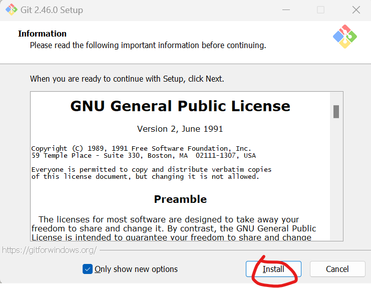

# Attendbot 🤖

<!--  -->

Attendbot is a powerful automation tool designed to simplify the process of submitting manual attendance in the Capgemini portal. Powered by Selenium and Beautiful Soup, Attendbot operates seamlessly in headless mode, providing a hassle-free experience for users.

---

## Features

- **Automated Attendance Submission:** Say goodbye to manual attendance submissions. Attendbot automates the process for you.

- **Headless Mode:** Operates in headless mode by default, ensuring smooth execution without displaying the browser window.

- **Logging and Reporting:** Generates detailed logs and reports of attendance marked, enabling users to verify and troubleshoot any issues.

- **Customizable:** Users can specify the month for which attendance needs to be applied, providing flexibility and convenience.

- **Interactive Mode:** Optionally, users can run the program in interactive mode (-i flag) to view the browser window and interact with it directly.


---

# Requirements

The requirements emntioned below needs to be addressed before our Bot can work, lets try to figure out whether you have all the requirements fulfilled or not.

- Python 3.10 or higher
- Git or an equivalent SCM tool installed.

> [!TIP] 
> **Not sure whether you have python?** Perform the following steps.

```
py --version
```
 or

```
python --version
```

 Should return a response like:

```
Python 3.11.4
```

> [!TIP] 
> **Checking out whether Git is installed on your device** Perform the following steps.

In your command line upon running the command `git` should return a simillar result:
```
usage: git [-v | --version] [-h | --help] [-C <path>] [-c <name>=<value>]
           [--exec-path[=<path>]] [--html-path] [--man-path] [--info-path]
           [-p | --paginate | -P | --no-pager] [--no-replace-objects] [--bare]
           [--git-dir=<path>] [--work-tree=<path>] [--namespace=<name>]
           [--config-env=<name>=<envvar>] <command> [<args>]
```
This means `git` is correctly installed on your device.

In case Git or any SCM is not installed [Click here](https://git-scm.com/download/win) to download **git**.
- Now depending your version of windows select `64-bit` or `32-bit` accordingly.
    
- After the download has finished, follow the instructions and complete the installation.
    
- For the detailed instructions please check the `imgs` folder it contains step-by-step instructions on how to install Git.
- Now you're good to go!


>[!Note]
>The installation process is pretty straight forward, just make sure to keep to the default settings unless you know what you are doing.
>If you dont have python installed, you may download [Python here](https://www.python.org/downloads/).


# Installation (Windows)


1. Navigate to an empty directory where you want to download the bot.

2. **Clone** The git **download** branch
    ```bash
    git clone --branch download https://github.com/Mrunemployed/AttendBot-CG.git
    ```

> [!Tip]
> ***Cloning*** in simple terms is creating a replica of the code that is publicly hosted on my github. Curious to know more? Read more about [Cloning](https://docs.github.com/en/repositories/creating-and-managing-repositories/cloning-a-repository).
> ***Branching*** in Git is like creating different game levels to try new ideas without messing up. Learn more about [Branching](https://git-scm.com/book/en/v2/Git-Branching-Branches-in-a-Nutshell)
> All these steps are to help us download the code that is hosted on **GitHub**.

3. Open Command Prompt.

4. Navigate to the directory containing the Attendbot package like : `cd ~\<someDir>\<Dir containing`.

5. Run the following command to install Attendbot:
    
    ```bash
    py -m pip install .
    ```

Congratulations you have now successfully installed the Bot!

---

# Usage

### Running the bot

1. Open Command Prompt.
2. Run the following command to mark attendance for the previous month:
   
    ```bash

    py -m Attendbot.mark -m<Month In Number>
    ```
    **example:**
    ```bash
    py -m Attendbot.mark -m8
    ```
This should tell the bot that you want it to mark your shift claim for the Month of August.
By default if you were to not mention any month, the Bot try to mark the attendence for the previous month.

### Interactive Mode

To run the Bot in interactive mode (displaying the browser window), use the `-i` flag:

```bash

py -m Attendbot.mark -i -m8
```


### Specifying Month
To specify the month for which attendance needs to be applied, use the -m flag followed by the month value (integer):
```

py -m Attendbot.mark -m6


```

Alternatively,

```

py -m Attendbot.mark -m 6


```

This command will mark attendance for June.

Or, you can use both the flags in conjunction:

```

py -m Attendbot.mark -m 6 -i

```

This will run the bot in Interactive mode and tell it to mark attendence for the month of June.

### Stopping the Bot

Press `CTRL` + `C` to stop the execution of the bot at runtime.

### Contribution

Contributions are welcome! If you have any suggestions, bug reports, or feature requests, feel free to open an issue or submit a pull request.

### Simplify Your Attendance Management with Attendbot! 🚀